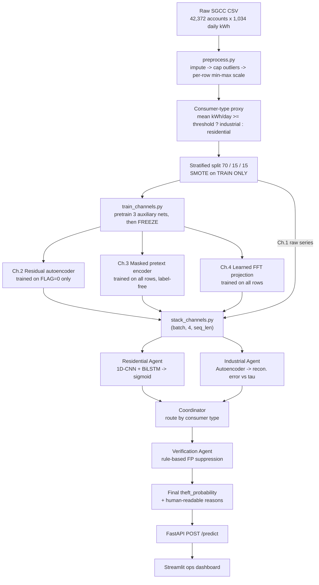

# Electricity Theft Detection — Project Reference

Channel-Boosted deep learning + a multi-agent scoring layer, targeting non-technical
loss (theft, tampering, billing fraud) for an electricity distribution company.

This document is the single source of truth for **what exists, what works, what is
broken, and what is still only a plan**. It supersedes the two `.docx` handoff
documents where they disagree with the code — every claim below was verified against
the actual files and the actual dataset on 2026-08-26.

---

## 1. Status at a glance

| Component | State |
|---|---|
| Python environment (`venv/`) | ✅ Working — Python 3.14.7, torch 2.13.0+cu130 (CUDA build) |
| Test suite (`pytest tests/`) | ✅ **5 passed** |
| Source code (22 files) | ✅ Complete scaffolding, imports cleanly |
| Dataset on disk | ✅ Full SGCC present (see §4 — but **not** at the path the config expects) |
| `data/processed/` | ❌ Empty — preprocessing has never been run |
| `models/checkpoints/` | ❌ Empty — **nothing has been trained** |
| FastAPI service | ❌ Cannot start — requires 5 missing checkpoint files |
| Streamlit dashboard | ❌ Cannot return results — depends on the API |
| Any accuracy number | ❌ **None exists.** No ROC-AUC, no F1, nothing measured |
| Transfer learning | ❌ **Designed on paper only — zero lines of code** (see §10) |

**Where the project actually stands:** the pipeline is written but has never been run
on real data. Progress is stalled at **Step 6** of the run order (§7), because five
concrete bugs block the path from raw CSV to a trained model. They are all listed
with file/line and a fix in §8.

> **Never report a number you did not measure yourself.** The published SGCC figure
> of ~92% ROC-AUC belongs to Zheng et al. (2018), not to this project. Until §7 is
> executed end to end, this system has no measured performance.

---

## 2. The problem being solved

Distribution companies (DISCOs) lose meaningful revenue every year to non-technical
losses — meter bypass, tampering, CT/PT manipulation, billing fraud. The standard
response is spot inspection, which is slow, expensive, and essentially random: an
inspector can only visit a tiny fraction of accounts, and picks them close to blind.

The pitch is to **replace random inspection with ranked suspicion** — score every
account from its consumption history and send inspectors to the top of the list.

Two different crimes need two different detectors:

- **Residential theft** — meter bypass or tampering. The signature is blunt:
  consumption crashes toward zero, or drops in a sudden sustained step. Framed as
  **supervised classification** (labels exist for this).
- **Industrial theft** — CT/PT tampering, selective peak-shaving, partial load
  stripping. Subtler: consumption doesn't vanish, it gets quietly shaved. Confirmed
  industrial cases are rare, so this is framed as **unsupervised anomaly detection**
  — learn normal, flag whatever reconstructs badly.

**What a DISCO actually needs**, and the bar this project has to clear: a model that
only outputs "theft / not theft" is not usable. Field teams need a *ranked,
explainable shortlist*, and false positives carry real cost (annoyed, potentially
litigious customers). A high AUC with no verification/coordination layer solves a
Kaggle problem, not a DISCO's problem. That is why the verification and coordinator
agents exist — and why the fact that they are currently inert (§9) matters as much
as any accuracy number.

---

## 3. How the system works

### 3.1 Data flow



### 3.2 Channel Boosting (the core modeling idea)

Instead of hand-crafting features, three small networks are **pretrained and then
frozen**, and their outputs become extra input channels alongside the raw series.
The channel comes out of a *trained network*, not a formula — that is what makes it
Channel Boosting rather than feature engineering.

| # | Channel | Source | Trained on | What it contributes |
|---|---|---|---|---|
| 1 | Raw series | `preprocess.py` output | — | The scaled consumption curve itself |
| 2 | Reconstruction residual | `channels/autoencoder_channel.py` | **normals only** (`FLAG == 0`) | Per-day \|x − recon\|: how un-normal each day looks |
| 3 | Pretext embedding | `channels/pretext_channel.py` | all rows (never sees the label) | Self-supervised representation, standing in for an ImageNet-style pretrained backbone which does not exist for time series |
| 4 | Frequency projection | `channels/frequency_channel.py` | all rows | A *learned* projection on top of the FFT magnitude spectrum — deliberately not raw FFT coefficients |

Stacked by `channels/stack_channels.py` into `(batch, 4, seq_len)`. All three
auxiliary nets run in `eval()` / `no_grad()` mode; `config.channels.freeze_after_pretrain`
documents the intent (no joint fine-tuning — overfitting risk on only 3,615 positives),
though the freezing is in fact hardcoded rather than read from config (§6).

### 3.3 The agents

- **Residential Agent** (`src/agents/residential/model.py`) — `Conv1d(4 → 64, k=3)`
  → ReLU → Dropout(0.3) → BiLSTM(64 → 128, bidirectional) → Linear(256 → 1) →
  sigmoid. Final hidden states of both LSTM directions are concatenated.
- **Industrial Agent** (`src/agents/industrial/model.py`) — a **second, separate**
  autoencoder: flatten `(4, seq_len)` → 512 → 128 → 32 → 128 → 512 → flat, sigmoid
  output. Scores by mean squared reconstruction error; flags above τ, where
  τ = 95th percentile of error on a verified-normal validation set.
  *Do not confuse this with the Channel-2 autoencoder* — that one produces an input
  channel, this one is the industrial scoring model itself.
- **Verification Agent** (`src/agents/verification/verify.py`) — deliberately
  rule-based, not a black box, because whoever reads a dispatch ticket needs to see
  why it fired. Current rules: recently-audited-and-cleared → ×0.3; known CT/PT
  calibration issue on the feeder → ×0.5; open billing dispute → note it, flag
  stands; prior confirmed theft → floor the score at 0.95. Every adjustment returns
  a human-readable reason string.
- **Coordinator** (`src/agents/coordinator/coordinator.py`) — plain Python control
  flow, intentionally **not** an LLM. Routes by consumer type, converts industrial
  reconstruction error into a comparable 0–1 score, runs verification, applies the
  threshold, returns a `ScoringResult`. If an LLM justification-writer is ever added,
  it must run asynchronously *after* this returns — never inside the synchronous
  scoring path.

---

## 4. The dataset

**Source:** SGCC (State Grid Corporation of China) electricity theft dataset —
`github.com/henryRDlab/ElectricityTheftDetection`. This is the only large, real,
theft-labelled consumption dataset publicly available, which is exactly why it is the
default starting point and exactly why it is not automatically right for a Pakistani
DISCO (§10).

### 4.1 There are two copies on disk — use the right one

| File | Rows | Theft | Normal | Theft rate | Verdict |
|---|---|---|---|---|---|
| `data/raw/data.csv` | 33,841 | 3,615 | 30,226 | 10.68% | ⚠️ **Truncated** — ~8,500 normal accounts missing, which inflates the apparent theft rate |
| `data/raw/recovered/data.csv` | **42,372** | **3,615** | 38,757 | **8.53%** | ✅ **Complete official dataset — use this one** |

`recovered/data.csv` matches the published SGCC headcount exactly (42,372 accounts,
3,615 theft). `data.csv` is an incomplete extraction from the split archive and
should not be used for any reported result.

### 4.2 Schema and real dimensions

```
CONS_NO, FLAG, 2014/1/1, 2014/1/10, 2014/1/11, ... , 2016/9/9
```

- `CONS_NO` — anonymised consumer ID (32-char hash)
- `FLAG` — `0` = normal, `1` = theft
- **1,034** daily-kWh columns, **not 1,035**

⚠️ Every prior document says "1,035 days." The real file has **1,034** day columns:
the range is 2014-01-01 → 2016-10-31 (a 1,035-day span) with **2016-09-18 missing**.
`src/api/app.py:37` hardcodes `SEQ_LEN = 1035` and will reject correctly-shaped real
data (§8).

Note the column order is **lexical, not chronological** (`2014/1/1`, `2014/1/10`,
`2014/1/11`, …, `2014/1/2`, `2014/1/20`, …). `preprocess.py` consumes them in file
order, so the "time series" fed to the CNN/LSTM is **shuffled within each month**.
See §9 — this is a real modeling concern, not a cosmetic one.

### 4.3 Data quality (measured, not assumed)

| Metric | Value |
|---|---|
| Overall missing-value rate | **25.64%** |
| Rows that are 100% NaN | 5 |
| Rows with ≥30 leading NaNs | **16,170 (38.2%)** |
| Per-customer mean daily kWh — median | 5.71 |
| — 99th percentile | 72.97 |
| — max | 13,601.10 |
| Class balance | 8.53% positive (3,615 / 42,372) |

A quarter of all readings are missing, and 38% of accounts open with a month or more
of blanks. How `impute_missing` handles that has direct consequences for the
residential detector — see §8/§9.

---

## 5. Repository layout

```
electricity-theft-detection/
├── config/config.yaml              # every path, threshold, hyperparameter
├── scripts/download_data.sh        # prints manual dataset-acquisition steps
├── data/
│   ├── raw/                        #  <- you place dataset files here (gitignored)
│   │   ├── data.csv                #     truncated copy — do not use
│   │   └── recovered/data.csv      #     COMPLETE dataset — use this
│   └── processed/                  #  <- written by preprocess.py (currently empty)
├── src/
│   ├── preprocessing/preprocess.py # impute, cap, scale, type-proxy, split, SMOTE
│   ├── channels/
│   │   ├── autoencoder_channel.py  # Ch.2 reconstruction residual
│   │   ├── pretext_channel.py      # Ch.3 masked-timestep self-supervised
│   │   ├── frequency_channel.py    # Ch.4 learned FFT projection
│   │   └── stack_channels.py       # combine Ch.1-4 -> (batch, 4, seq_len)
│   ├── agents/
│   │   ├── residential/model.py    # 1D-CNN + BiLSTM classifier
│   │   ├── industrial/model.py     # scoring autoencoder + derive_tau()
│   │   ├── verification/verify.py  # rule-based FP suppression
│   │   └── coordinator/coordinator.py  # routing + fusion + final decision
│   ├── training/
│   │   ├── train_channels.py       # pretrain the 3 auxiliary nets, then freeze
│   │   ├── train_residential.py    # train classifier, early-stop on val ROC-AUC
│   │   └── train_industrial.py     # train AE on normals + derive tau
│   └── api/app.py                  # FastAPI POST /predict
├── dashboard/app.py                # Streamlit ops dashboard
├── models/checkpoints/             # .pt weights land here (currently empty)
├── tests/test_preprocessing.py     # 5 tests, all passing
├── notebooks/                      # exploratory only — nothing production runs here
├── requirements.txt
├── Dockerfile / docker-compose.yml / .dockerignore
├── Electricity_Theft_Detection_Manual.docx   # step-by-step handoff manual
└── Final-Document.docx             # pitch narrative + team split + transfer plan
```

### Checkpoint files the API expects in `models/checkpoints/`

`autoencoder_channel.pt` · `pretext_channel.pt` · `frequency_channel.pt` ·
`residential_model_best.pt` · `industrial_model.pt` · `industrial_tau.txt`

All six are produced by steps 3–5 of §7. All six are currently absent.

---

## 6. Configuration reference

Everything tunable lives in `config/config.yaml`. Keys marked **dead** are present
in the file but never read by any code — do not expect changing them to do anything.

| Key | Value | Read by |
|---|---|---|
| `paths.raw_sgcc_csv` | `data/raw/sgcc_data.csv` | `preprocess.py` — ⚠️ **file does not exist** (§8.1) |
| `paths.raw_precon_dir` | `data/raw/precon/` | **dead** |
| `paths.processed_dir` | `data/processed/` | preprocess + all 3 training scripts |
| `paths.checkpoints_dir` | `models/checkpoints/` | all 3 training scripts + API |
| `preprocessing.outlier_sigma_cap` | `2` | `preprocess.py` — ⚠️ README calls this "3-sigma"; the config's own comment notes this contradiction already caused a spec conflict once |
| `preprocessing.scale_range` | `[0, 1]` | `preprocess.py` |
| `preprocessing.val_split` / `test_split` | `0.15` / `0.15` | `preprocess.py` |
| `preprocessing.smote_on_train_only` | `true` | `preprocess.py` — **never make this apply to val/test**; that leaks synthetic data into evaluation and makes every metric fiction |
| `preprocessing.random_seed` | `42` | `preprocess.py` |
| `consumer_type_proxy.method` | `consumption_magnitude` | **dead** (documentation only) |
| `consumer_type_proxy.daily_kwh_industrial_threshold` | `500` | `preprocess.py` — ⚠️ selects only 37 of 42,372 accounts (§8.5) |
| `channels.use_raw` | `true` | **dead** (Ch.1 is always included) |
| `channels.use_autoencoder_residual` | `true` | stack + all training + API |
| `channels.use_pretext_embedding` | `true` | stack + all training + API |
| `channels.use_frequency_projection` | `true` | stack + all training + API |
| `channels.freeze_after_pretrain` | `true` | **dead** — freezing is hardcoded |
| `residential_model.*` | filters 64, kernel 3, LSTM 128, dropout 0.3, batch 64, epochs 30, lr 1e-3, patience 5 | `train_residential.py`, API — ⚠️ also reused for all three channel nets (§9) |
| `industrial_model.autoencoder_latent_dim` | `32` | `train_industrial.py`, API |
| `industrial_model.batch_size` / `epochs` / `learning_rate` | 32 / 40 / 5e-4 | `train_industrial.py` |
| `industrial_model.tau_percentile` | `95` | `train_industrial.py` |
| `scoring.theft_probability_threshold` | `0.65` | Coordinator via API — **must be justified in the report, not left unexplained** |
| `api.host` / `api.port` | `0.0.0.0` / `8000` | **dead** — set on the `uvicorn` command line instead |

---

## 7. How to run it — exact order

Steps must not be skipped or reordered: each one consumes the previous one's output.

```bash
# 0. environment  (re-run the activate line in every new terminal)
python -m venv venv
source venv/bin/activate            # fish shell: source venv/bin/activate.fish
pip install -r requirements.txt

# 1. dataset — prints instructions; the download itself cannot be scripted
bash scripts/download_data.sh
#    The dataset is already present in data/raw/. Point config.paths.raw_sgcc_csv
#    at data/raw/recovered/data.csv  (the complete copy — see §4.1 and §8.1).

# 2. preprocess — impute / cap / scale / type-proxy / split / SMOTE
python -m src.preprocessing.preprocess --config config/config.yaml

# 3. pretrain the 3 auxiliary channel networks (TRAIN SPLIT ONLY)
python -m src.training.train_channels --config config/config.yaml

# 4. train the residential classifier (channels frozen from step 3)
python -m src.training.train_residential --config config/config.yaml

# 5. train the industrial autoencoder + derive tau
python -m src.training.train_industrial --config config/config.yaml

# 6. tests — every line must say PASSED before you trust anything above
pytest tests/

# 7. serve (leave running in its own terminal)
uvicorn src.api.app:app --host 0.0.0.0 --port 8000

# 8. optional ops dashboard (second terminal, venv activated)
streamlit run dashboard/app.py
```

### Read these printouts — do not skip past them

- **After step 2:** the script prints the class balance of all three splits. Train
  should be balanced (SMOTE); **val and test must NOT be** — if they look evenly
  balanced, resampling has leaked into evaluation and every metric downstream is
  fiction.
- **After step 4:** the per-epoch `val_auc` / `val_f1` is the **first honest number
  this project has ever produced.** Write it down. Watch the train-loss vs.
  val-metric gap — a large gap means overfitting on the small positive class
  (3,615 accounts total), which is expected and must be checked, not assumed away.
- **After step 5:** the script prints how many industrial-typed normal accounts it
  actually found. At the current threshold that number is ~8 (§8.5). A τ derived
  from that is meaningless — the industrial half of the system is not usable until
  the threshold is fixed.

### Docker path (optional)

```bash
docker compose build
docker compose run --rm trainer python -m src.preprocessing.preprocess --config config/config.yaml
docker compose up api dashboard          # ports 8000 and 8501
```

`data/`, `models/`, and `config/` are bind-mounted, so artifacts survive the
container. Note the `trainer` service defines no `command` and therefore inherits
the image's uvicorn `CMD` — always pass an explicit command as shown above.

---

## 8. Blockers — must be fixed before anything runs

These are ordered by when they will stop you. All were verified by reading the code
and measuring the real dataset.

### 8.1 The configured dataset path does not exist — Step 2 dies instantly
`config/config.yaml:2` points at `data/raw/sgcc_data.csv`. That file was never
created; what exists is `data/raw/data.csv` (truncated) and
`data/raw/recovered/data.csv` (complete).

**Fix:** `raw_sgcc_csv: "data/raw/recovered/data.csv"`

### 8.2 SMOTE desynchronises the consumer-type array — Step 4 crashes
`preprocess.py:114-119` resamples `X_train` and `y_train` but deliberately leaves
`ct_train` alone (the code comments on it). `type_train.npy` is therefore saved at
the *pre*-SMOTE length while `X_train.npy` is longer. Then
`train_residential.py:56-62` builds `mask = ctype == "residential"` and applies it
to `X` — a boolean mask shorter than the array it indexes.

**Fix:** carry an index through SMOTE and re-derive the proxy type for synthetic
rows, or (simpler and defensible) filter to residential rows *before* resampling so
SMOTE only ever sees one consumer type.

### 8.3 `SEQ_LEN` is off by one — the API rejects valid data
`src/api/app.py:37` hardcodes `SEQ_LEN = 1035`; the real data has 1,034 day columns
(§4.2). Every well-formed request gets a 400.

**Fix:** derive `SEQ_LEN` from the saved training data or from a value written at
preprocess time, rather than hardcoding it.

### 8.4 Train/serve skew — the API feeds raw kWh to models trained on scaled data
`preprocess.py` applies impute → outlier cap → **per-row min-max scale to [0,1]**.
`app.py:111` does `torch.tensor([req.daily_kwh])` and passes it straight in, with
none of those three steps. The model receives values in the tens-to-thousands where
it was trained on 0–1. Predictions will be meaningless even after training succeeds.

**Fix:** extract the per-row transform from `preprocess.py` into a shared function
and call it from both the preprocessing script and the API request path.

### 8.5 The industrial proxy threshold selects almost nobody — the Industrial Agent is statistically empty
`daily_kwh_industrial_threshold: 500`, measured against the real dataset:

| Threshold (mean kWh/day) | Accounts selected |
|---|---|
| **≥ 500 (current)** | **37** — of which only **12** are normal (`FLAG=0`) |
| ≥ 100 | 287 |
| ≥ 50 | 649 |
| ≥ 20 | 2,731 |

After the 70/15/15 split, the Industrial Agent would train on roughly **8 accounts**
and derive τ — the 95th percentile of reconstruction error — from roughly **2**.
`train_industrial.py:48-50` only raises if the count is exactly zero, so this will
not crash: **it will silently produce a garbage τ**, and the coordinator will then
use that τ as the denominator for every industrial score.

Also worth noting: 25 of the 37 high-consumption accounts are *theft*-flagged, so the
"verified-normal industrial" population the design depends on barely exists in SGCC.

**Fix:** lower the threshold to something the data supports (≥50 kWh/day gives 649
accounts, ~13× the current pool), or drop the proxy entirely and select the top-N
accounts by consumption magnitude. Either way, whatever you choose is a **heuristic,
not ground truth** — SGCC has no consumer-type column at all — and every report must
say so.

### 8.6 Performance — `preprocess.py` is row-at-a-time Python
`preprocess.py:80` iterates `df.iterrows()` over 42,372 rows × 1,034 columns, calling
three pure-Python functions per row (`impute_missing` itself loops element by
element). Expect a very long run. Vectorising with NumPy is straightforward and worth
doing before you burn an afternoon on a run you may need to repeat.

---

## 9. Known design issues and weaknesses

Distinct from §8: these do not stop execution, but they will hurt results or
undermine the pitch if left unaddressed and unstated.

**Day columns are in lexical, not chronological, order.** `2014/1/1, 2014/1/10,
2014/1/11, …, 2014/1/2, 2014/1/20, …` — `preprocess.py` takes them in file order, so
each month is internally shuffled before being handed to a CNN and a BiLSTM, both of
which exist specifically to exploit temporal ordering. Sorting the day columns by
parsed date is a one-line change with a plausibly large effect.

**Imputation manufactures the exact signature being detected.** `impute_missing`
(`preprocess.py:41-48`) only inspects immediate neighbours and scans forward using
values it has already written. A leading run of NaNs therefore collapses to all
zeros — and 16,170 accounts (38%) open with ≥30 blank days. Since the residential
theft signature *is* "consumption crashes to near zero," this fabricates positive
evidence on more than a third of the dataset. Consider masking unobserved days
instead of zero-filling them, and exclude the 5 all-NaN rows outright.

**The industrial score is miscalibrated against its own threshold.**
`coordinator.py:41` computes `min(err / τ, 1.0)`, and `scoring.theft_probability_threshold`
is `0.65`. Since τ is by construction the 95th percentile of *normal* error, any
normal account with error above `0.65 · τ` gets flagged — a large fraction of normals
by design. The ratio is also not a probability, so calling the output
`theft_probability` overstates what it is.

**The Verification Agent never fires.** `app.py:118` constructs
`CustomerContext(consumer_id=...)` with every other field left at its default, so no
rule can ever trigger: `reasons` is always empty and the score is never adjusted. The
"multi-agent" system in the demo is currently one model plus a pass-through. This is
Eimaan's stream (§11) and is known, but until it is wired to real billing/audit data
the demo does not show the layer the pitch depends on. `verify.py` says so itself: it
cannot run on SGCC alone, which has no billing or audit columns.

**The pretext channel is degenerate.** `pretext_channel.py:35` computes
`z.mean(dim=1, keepdim=True).expand(-1, seq_len)` — it collapses the 32-dimensional
embedding to a **single scalar per account** and broadcasts it across all 1,034
timesteps. The Conv1d therefore sees a constant channel carrying one number where 32
dimensions of learned representation were intended. It runs, and it contributes
almost nothing.

**Channel pretraining borrows the residential model's hyperparameters.**
`train_channels.py` passes `cfg["residential_model"]` epochs, lr, and batch size to
all three auxiliary networks. There is no `channels` training section in the config,
so the three nets cannot be tuned independently.

**The whole industrial premise sits on a proxy label.** SGCC has no consumer-type
field. `assign_consumer_type_proxy` splits on consumption magnitude and will
misclassify small industrial users and unusually large households in both directions.
The function's own docstring demands this be stated in any report — do state it.

**`min-max` scaling is per-account.** Each customer is normalised to their own
min/max, which deliberately removes absolute magnitude. That is reasonable for shape
detection but means the model cannot see scale, and the consumer-type proxy must be
computed on raw values (it is — `preprocess.py:90` — correctly).

**Git/LFS hygiene.** `git lfs ls-files` tracks `data/raw/data.csv` (the *truncated*
copy) against `github.com/Hashwar-11/Hackathon-AliCloud.git`, while `.gitignore` also
ignores it. The **complete** `recovered/data.csv` is not in LFS at all — so a
teammate cloning the repo gets either nothing or the wrong file. Decide deliberately:
either LFS-track the complete copy, or document the manual acquisition steps and keep
both out of git.

**Deprecated FastAPI startup hook.** `app.py:95` uses `@app.on_event("startup")`,
deprecated in favour of lifespan handlers. Harmless today, will warn.

---

## 10. Transfer learning: designed, not implemented

`Final-Document.docx` builds its central argument on transfer learning. **Be precise
about its status: the code does not exist.** There is no fine-tuning script, no
target-domain loader, no transfer-specific freezing logic; `paths.raw_precon_dir` is a
dead config key. This is a design, not an implementation.

### The argument (which is sound)

SGCC is Chinese consumption data. Pakistani customers use electricity differently —
different appliances, tariffs, climate-driven load curves, theft methods. A model
trained purely on SGCC and pointed at Pakistani meters will underperform, possibly
badly. But training purely on Pakistani data is impossible: nowhere near 42,000
labelled confirmed cases exist. Transfer learning / domain adaptation is the
established answer in exactly this research area.

### The intended mechanics

1. **Source domain:** pretrain the full pipeline — Channel Boosting plus both
   detector heads — on SGCC.
2. **Freeze what generalises:** the Channel-Boosting layers and the early
   convolutional/pooling blocks learn generic "what does a consumption series look
   like" structure, not China-specific patterns.
3. **Fine-tune what doesn't:** add fresh trainable dense layers on top and fine-tune
   only those (optionally unfreezing the last block) on the Pakistani target set.
4. **Target domain, deliberately small:** published work in this space fine-tunes on
   500–1,000 labelled target samples, because coping with a data-starved new market
   is the entire point of the technique.
5. **Where the labels come from:** FIR-confirmed theft cases from a DISCO, plus DSU
   (Distribution Safety Unit) high-loss-feeder findings from a pilot area. This is
   not a public download — someone has to physically request records.

### Honest caveats — do not oversell this

- The published SGCC "source vs. target" experiments split *one* dataset into two
  synthetic domains, which understates real domain shift. **China → Pakistan is a far
  bigger jump than city → city within China.** Expect a real accuracy drop after
  fine-tuning, and never present SGCC's ~92% ROC-AUC as the expected number for a
  Pakistani deployment.
- **Fifty confirmed cases is not enough to fine-tune on** and will not produce a
  defensible result. If the team cannot realistically reach the low hundreds before
  the deadline, the honest move is to present the SGCC-only model as the baseline and
  the transfer step as *"designed, pending target-domain data"* — not as a finished,
  validated result. Claiming a validated transfer result on data that does not exist
  is the fastest way to get taken apart in Q&A.
- **The single biggest open risk to the entire project** is whether real
  target-domain labels arrive in time. Everything else is executable with what is
  already built.

---

## 11. Team split and ownership

Split by pipeline stage rather than seniority, so each person owns a complete,
defensible piece they can speak to in Q&A. The three streams are comparable in size
and difficulty — none is the token easy one. This is a starting assignment based on
what each stream requires, not a judgment of anyone's ability; swap if it doesn't
match actual strengths.

### Maheen — Data & Ground Truth
- Verify the SGCC dataset is complete and correctly labelled. **Partly done and
  already answered by this document:** `data.csv` is truncated (33,841 rows);
  `recovered/data.csv` is complete (42,372 rows, 3,615 theft). Use the latter.
- Run and sanity-check `preprocess.py`; confirm the training split is balanced and
  val/test are **not**.
- Lead the Pakistani target-domain data hunt: identify a DISCO contact, request
  FIR-confirmed theft records and DSU high-loss-feeder findings from a pilot area.
- Design the labelling scheme mapping raw Pakistani records onto the same binary
  theft/normal label SGCC uses, so the two datasets are actually compatible.
- Own the data honesty item: document exactly how many confirmed Pakistani cases were
  obtained, and say plainly if that number is too small to trust.

### Hashwar — Modeling & Transfer Learning
- Train the Channel-Boosting layer and both detector heads on SGCC (source-domain
  pretraining).
- Train and validate the residential 1D-CNN + BiLSTM; record real ROC-AUC and F1 on
  the SGCC validation split.
- Train the industrial autoencoder and **report how many industrial-type accounts
  actually exist** before drawing any conclusion from it (§8.5 — currently ~8, which
  is not a usable basis for τ).
- Implement the transfer step: freeze Channel Boosting + early layers, add and
  fine-tune new dense layers on the target set once it exists.
- Report the benchmark comparison honestly: SGCC-only baseline vs. fine-tuned,
  including the expected dip. Do not report only the best number.

### Eimaan — Systems, Verification & Evaluation
- Build out the Verification Agent's business rules (confidence thresholds, sustained
  duration checks) so raw scores become a defensible, low-false-positive shortlist —
  and wire it to real context, since it is currently inert (§9).
- Implement coordinator logic that merges residential + industrial + verification
  output into one ranked feeder/region list.
- Wire and test the FastAPI service and Streamlit dashboard end to end against the
  trained models.
- Own `pytest tests/` continuously — nobody moves past a failing test — and report
  pass/fail state to the team.
- Compile the final report: benchmark table, the honesty checklist across all three
  streams, and the plain-language "what this is and why it works" narrative for a
  non-technical judge.

---

## 12. Honesty checklist

Do all of these before writing any number into a report or slide.

- [ ] Validation and test class balance printed and confirmed **not** SMOTE-balanced.
- [ ] Train vs. validation curves logged; the overfitting gap on 3,615 positives
      explicitly examined, not assumed away.
- [ ] Every reported metric measured on this data by this team — no figure copied
      from a published paper.
- [ ] The consumer-type split stated as a **magnitude heuristic**, not ground truth
      (SGCC has no consumer-type column).
- [ ] The industrial sample count stated explicitly; if it is tiny, the Industrial
      Agent's results labelled unproven.
- [ ] `theft_probability_threshold: 0.65` justified, not left unexplained.
- [ ] Transfer learning labelled either "validated on real target data" **or**
      "designed / implemented, pending data" — never presented as more finished than
      it is.
- [ ] Pakistani confirmed-case count reported with an honest headcount, however small.
- [ ] If synthetic theft is ever injected (e.g. Jokar et al. 2015 attack functions on
      PRECON), the report says the positives are synthetic.
- [ ] All `pytest` tests passing before the pitch — not "mostly passing."

---

## 13. Deployment

**Local (what exists today):** FastAPI (`src/api/app.py`) loading all six checkpoints
once at startup and exposing `POST /predict`; Streamlit dashboard for manually
scoring one account.

```
POST /predict
  { "consumer_id": "abc123",
    "client_type": "residential" | "industrial",
    "daily_kwh":   [float, ...]   # must be exactly SEQ_LEN values }

200 { "consumer_id": "abc123",
      "theft_probability": 0.0-1.0,
      "is_theft_suspect": true|false,
      "reasons": ["..."] }
```

Errors: `503` if models are not loaded, `400` on wrong sequence length or an unknown
`client_type`. See §8.3 and §8.4 — this endpoint needs both fixes before its output
means anything.

**Cloud path (as designed, not built):** SLS (log ingestion) → MaxCompute (batch
processing) → PAI-EAS (model serving) → Function Compute (alerting), on Alibaba Cloud.

---

## 14. Troubleshooting

| Symptom | Cause |
|---|---|
| `ModuleNotFoundError` | venv not activated, or `pip install -r requirements.txt` not run |
| `FileNotFoundError: sgcc_data.csv` | §8.1 — repoint `config.paths.raw_sgcc_csv` at `data/raw/recovered/data.csv` |
| Boolean-mask / length mismatch in step 4 | §8.2 — SMOTE desynchronised `type_train.npy` |
| `FileNotFoundError: .../autoencoder_channel.pt` | Steps 3–5 not run; `models/checkpoints/` is empty |
| `400 Expected 1035 daily readings, got 1034` | §8.3 — hardcoded `SEQ_LEN` |
| API returns implausible probabilities | §8.4 — raw kWh sent to a model trained on min-max-scaled input |
| `RuntimeError: No industrial-typed normal rows found` | §8.5 — proxy threshold too high |
| Metrics look suspiciously perfect | Check the step-2 balance printout first — resampling may have reached val/test |
| A `pytest` test fails | Stop. Do not proceed past step 6 |

---

## 15. What "done" actually looks like

1. A real, measured ROC-AUC and F1 on SGCC — produced on this machine, by this team.
2. A documented Pakistani target dataset with an honest headcount, even if small.
3. A transfer-learning result labelled clearly as either validated or pending data.
4. A working end-to-end demo (API + dashboard) a judge can actually poke at — not
   just slides.
5. All tests passing before the pitch.
6. The verification/coordination layer visibly turning scores into a ranked,
   explainable shortlist — because that, not the AUC, is what makes this useful to a
   DISCO.

**Bottom line:** the architecture is sound and the transfer-learning argument is
legitimate and literature-backed. Two things will decide the outcome — whether the
five blockers in §8 get fixed so a real number exists at all, and whether the data
stream delivers real target-domain labels in time.

---

## 16. Provenance and citations

- The repository code was generated from a single markdown spec using Alibaba's
  **Qoder** agentic coding tool, not hand-written line by line — worth knowing when
  someone asks who wrote it.
- Every model file was smoke-tested on random synthetic data to confirm it trains
  without crashing. One real bug was found and fixed in that process: an
  outlier-capping function that misbehaved on tiny arrays (see the comment in
  `tests/test_preprocessing.py:18-21`).
- **SGCC dataset citation (required if you publish results):** Zheng, Z., Yang, Y.,
  Niu, X., Dai, H.N., Zhou, Y. "Wide and Deep Convolutional Neural Networks for
  Electricity-Theft Detection to Secure Smart Grids." *IEEE Transactions on
  Industrial Informatics*, 14(4), 2018.
- **PRECON** (Pakistan Residential Electricity Consumption Dataset, via
  opendata.com.pk) is optional and has **no theft labels**. Use it only for (a)
  unsupervised normal-baseline training or (b) synthetic theft injection (Jokar et
  al., 2015). If (b), the report must say the theft examples are synthetic.
- Companion documents: `Electricity_Theft_Detection_Manual.docx` (step-by-step
  operational handoff) and `Final-Document.docx` (pitch narrative, transfer-learning
  plan, team split). Where either disagrees with this file, this file was verified
  against the code and the data.
